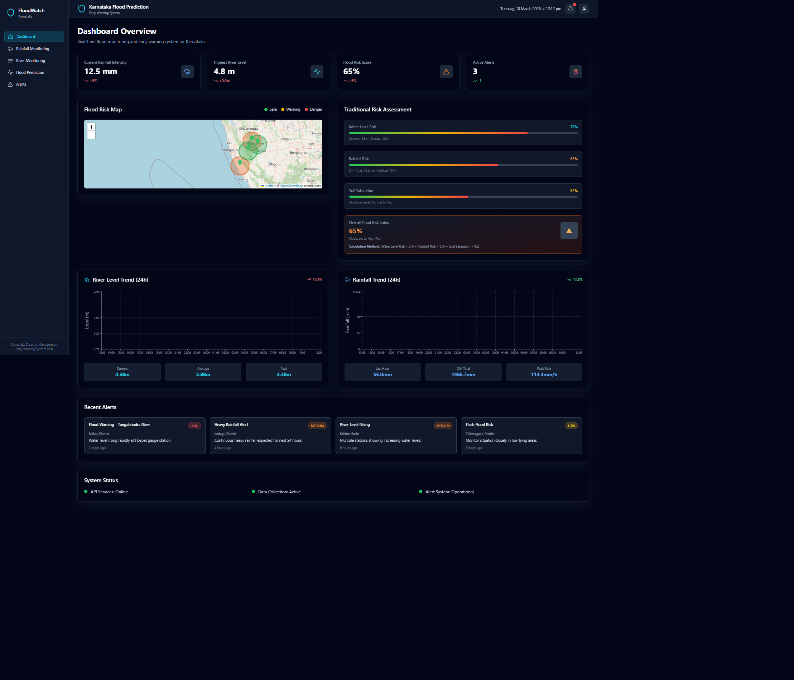
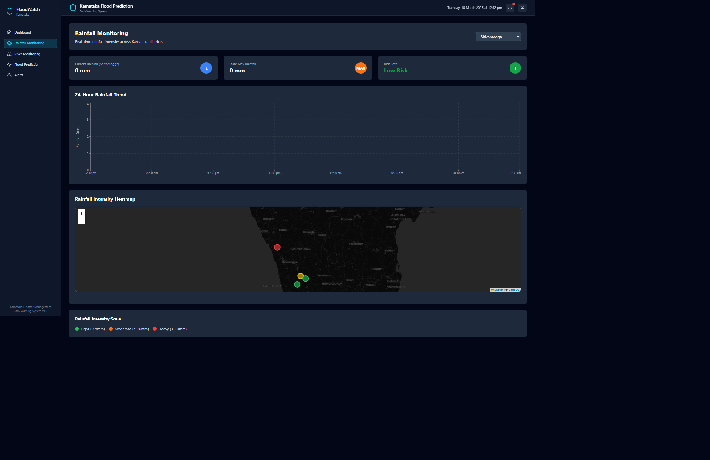
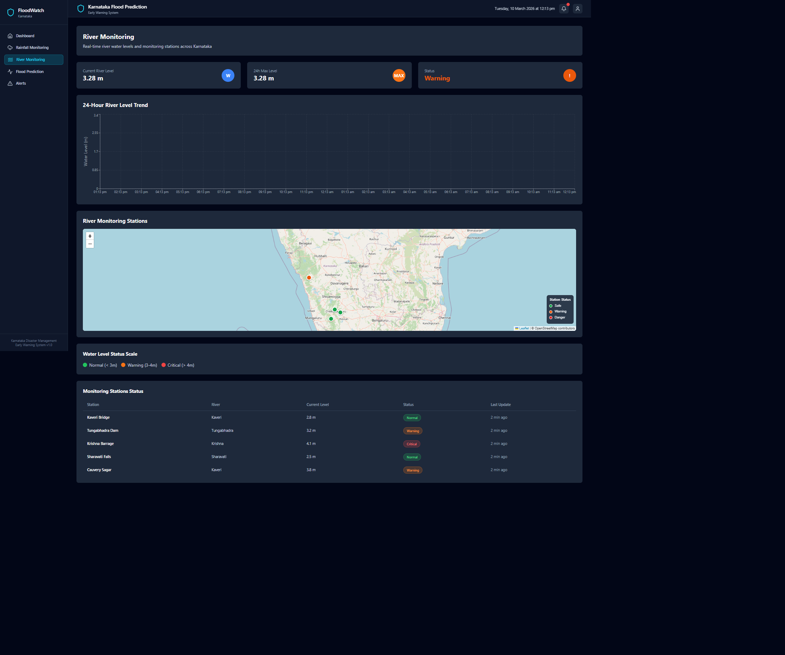
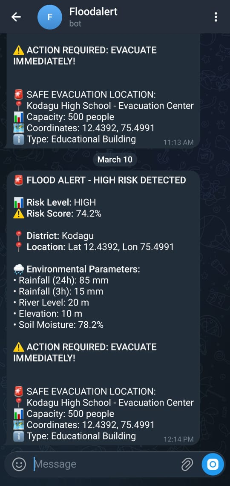
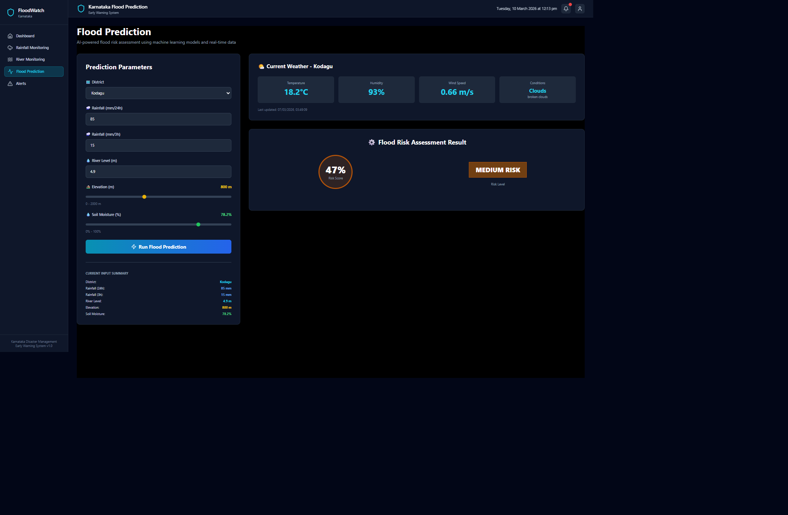
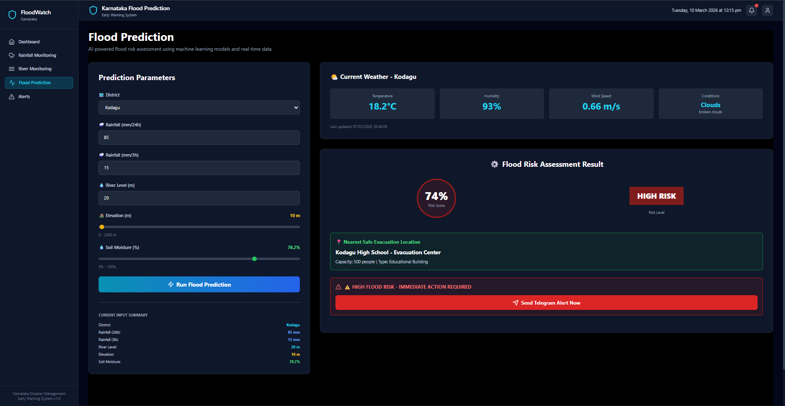
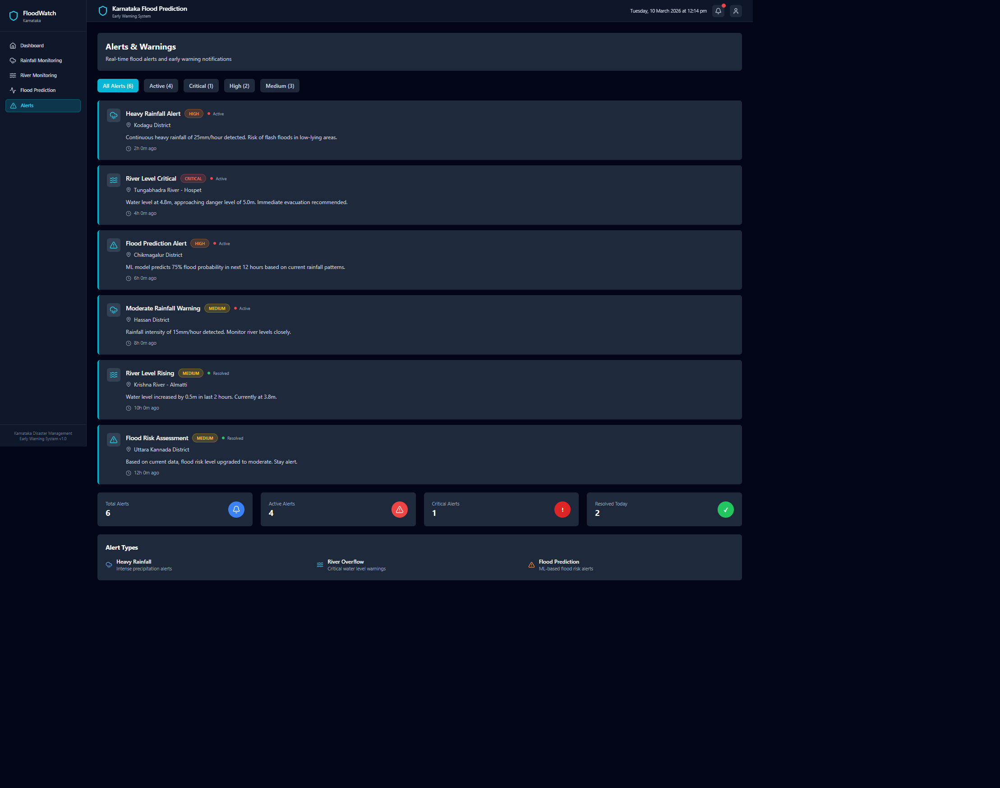

# FloodGuard - Karnataka Flood Early Warning System

Live project: https://floodguards.netlify.app/

## Project Status
This repository now supports a Netlify-first setup where flood prediction on the `Prediction` page runs directly in browser code (no separate prediction server required).

## What Works
- Flood risk prediction using user-entered parameters (rainfall, river level, elevation, soil moisture, district, coordinates)
- Risk classification into `low`, `medium`, `high`, `critical`
- Nearest safe-location suggestion for high/critical risk
- Rainfall and weather visual pages
- River and evacuation map pages
- Alerts page UI

## Flood Prediction Logic (In-App)
The prediction flow computes risk locally using weighted environmental factors:
- `rainfall_24h`
- `rainfall_3h`
- `river_level`
- `elevation` (lower elevation increases risk)
- `soil_moisture`
- district risk factor

The score includes:
- weighted base score
- interaction bonuses for dangerous combinations (for example heavy rain + high river level)
- risk floors for severe thresholds

Output includes:
- risk score (0 to 1)
- confidence percentage
- risk level
- nearest evacuation location when risk is high/critical

## Main Routes
- `/` : dashboard overview
- `/prediction` : local flood prediction calculator
- `/rainfall` : rainfall and weather views
- `/rivers` : river monitoring map
- `/evacuation` : evacuation support map
- `/alerts` : alert view

## Tech Stack
- Next.js 14
- React 18
- Tailwind CSS
- Leaflet / React-Leaflet
- Recharts

## Environment Variables
Only frontend variables are needed for the deployed UI:

```env
NEXT_PUBLIC_OPENWEATHER_API_KEY=your_openweather_key
NEXT_PUBLIC_MAP_API_KEY=optional_map_key
NEXT_PUBLIC_API_TIMEOUT_MS=15000
```

Notes:
- `NEXT_PUBLIC_OPENWEATHER_API_KEY` is used by rainfall/weather pages.
- Flood prediction itself does not require backend API access.

## Local Development
```bash
npm install
npm run dev
```

Production build:
```bash
npm run build
```

## Deployment
Hosted on Netlify:
- Build command: `npm ci && npm run build`
- Publish directory: `.next`
- Node version: `20`

## Screenshots

### Home / Dashboard

### Rainfall View


### Rivers / Maps


### Bot Alert


### Prediction Page



### Alerts / Warnings


## Repository Notes
- There is only one README file in this repository: `README.md`.
- Legacy backend and integration documents are kept in the repo for reference, but the main prediction workflow is now frontend-local.

